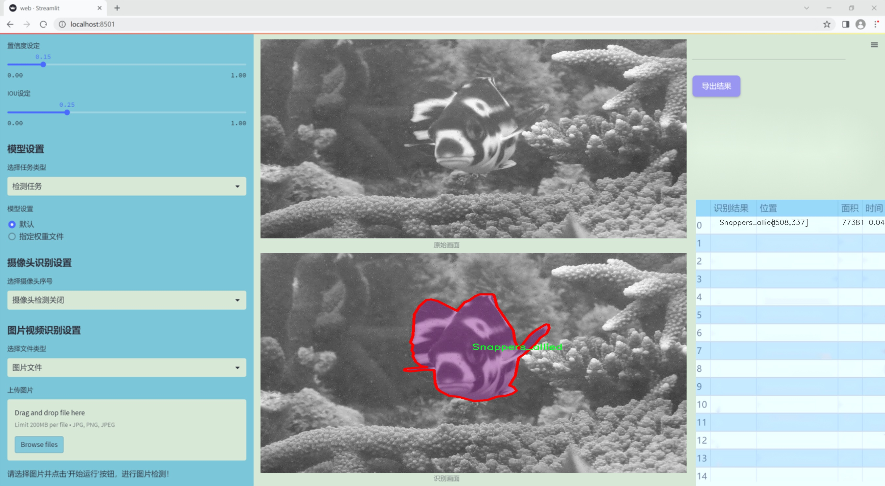
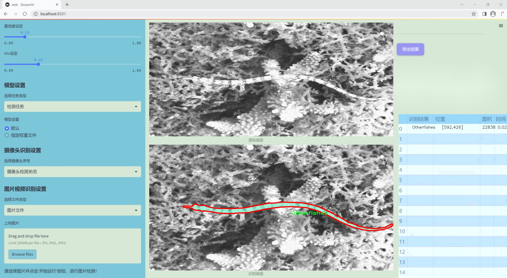
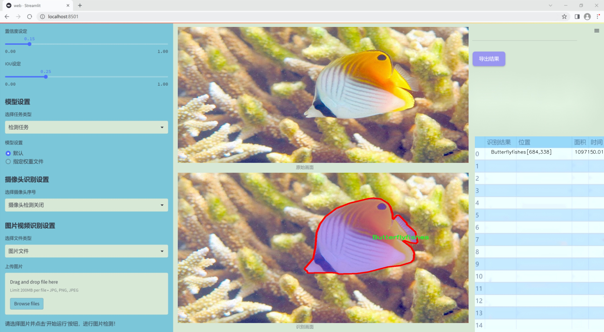
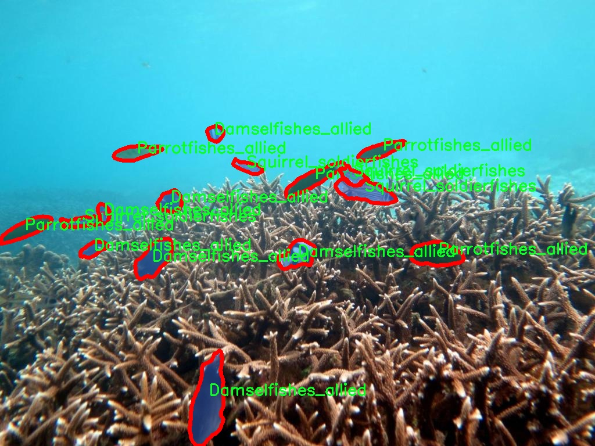
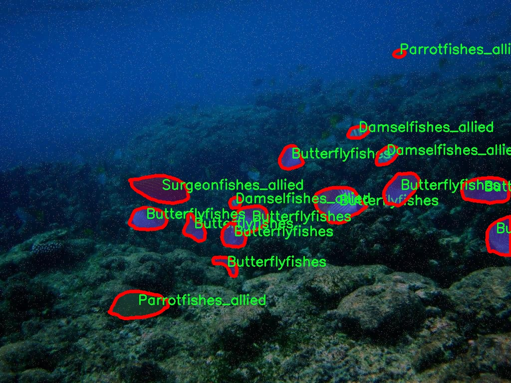
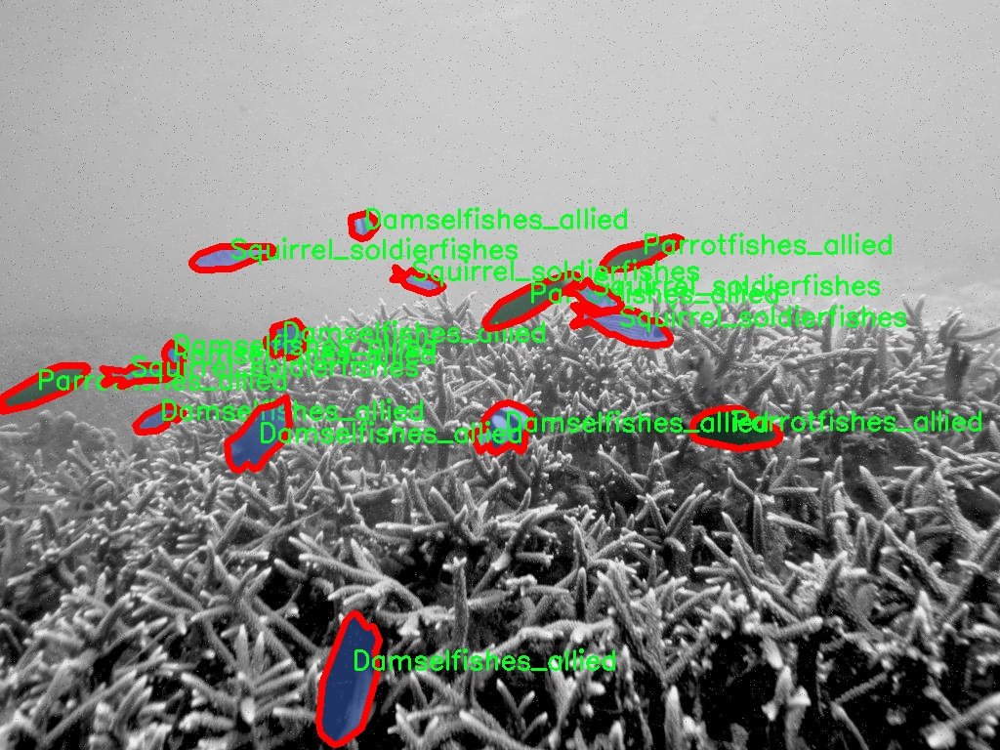
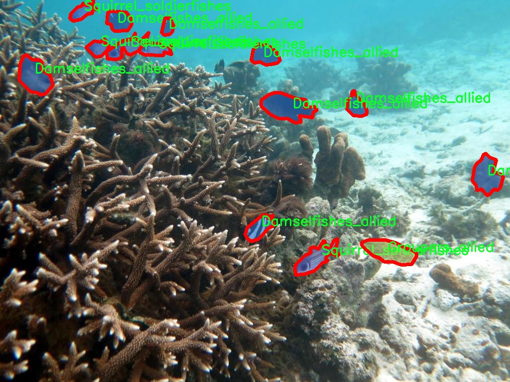
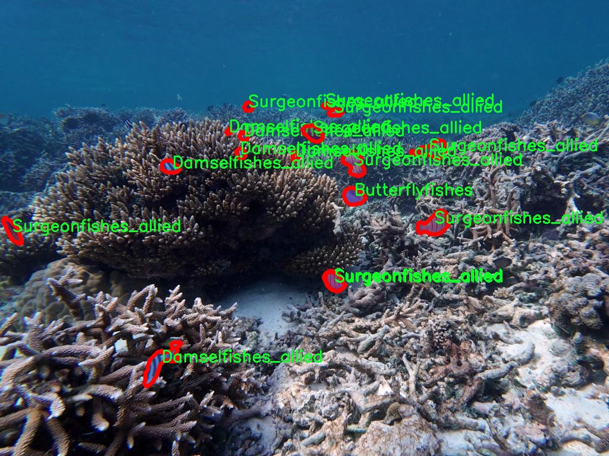

### 1.背景意义

研究背景与意义

珊瑚礁生态系统是全球海洋生物多样性的重要组成部分，其健康状况直接影响到海洋生态平衡和人类的生存环境。然而，近年来，由于气候变化、污染和过度捕捞等因素，珊瑚礁及其栖息的鱼类面临着前所未有的威胁。因此，开展对珊瑚礁鱼类的监测与保护研究显得尤为重要。传统的鱼类监测方法往往依赖于人工观察和捕捞，不仅耗时耗力，而且容易受到人为因素的干扰，导致数据的准确性和可靠性下降。为此，基于计算机视觉技术的自动化监测系统应运而生，成为解决这一问题的有效手段。

在众多计算机视觉技术中，YOLO（You Only Look Once）系列模型因其高效的实时目标检测能力而备受关注。YOLOv11作为该系列的最新版本，具备更强的特征提取能力和更快的处理速度，适合于复杂的海洋环境下的鱼类实例分割任务。本研究旨在基于改进的YOLOv11模型，构建一个高效的珊瑚礁鱼类实例分割系统。该系统将利用包含1300幅图像和19个鱼类类别的丰富数据集，通过深度学习算法实现对珊瑚礁鱼类的自动识别与分割。

通过对珊瑚礁鱼类的实例分割，不仅可以提高监测的效率和准确性，还能为生态保护和资源管理提供科学依据。此外，该系统的成功应用将为其他海洋生物的监测与保护提供借鉴，推动计算机视觉技术在生态环境保护领域的广泛应用。因此，本研究具有重要的理论意义和实际应用价值，期待为珊瑚礁生态系统的可持续发展贡献一份力量。

### 2.视频效果

[2.1 视频效果](https://www.bilibili.com/video/BV1VakrYHEKw/)

### 3.图片效果







##### [项目涉及的源码数据来源链接](https://kdocs.cn/l/cszuIiCKVNis)**

注意：本项目提供训练的数据集和训练教程,由于版本持续更新,暂不提供权重文件（best.pt）,请按照6.训练教程进行训练后实现上图演示的效果。

### 4.数据集信息

##### 4.1 本项目数据集类别数＆类别名

nc: 17
names: ['Acanthuridae_Acanthurus_Surgeonfish', 'Anemonefishes', 'Boxfishes_allied', 'Breams', 'Butterflyfishes', 'Damselfishes_allied', 'Eel', 'Goatfishes_allied', 'Groupers_allied', 'Otherfishes', 'Parrotfishes_allied', 'Snappers_allied', 'Squirrel_soldierfishes', 'Surgeonfishes_allied', 'Sweetlips', 'Triggerfishes_allied', 'damselfish_Pomacentridae_Abudefduf']


该项目为【图像分割】数据集，请在【训练教程和Web端加载模型教程（第三步）】这一步的时候按照【图像分割】部分的教程来训练

##### 4.2 本项目数据集信息介绍

本项目数据集信息介绍

本项目旨在通过改进YOLOv11算法，构建一个高效的珊瑚礁鱼类实例分割系统，以促进对海洋生态系统的研究和保护。为实现这一目标，我们使用了一个专门针对珊瑚礁鱼类的多样化数据集，涵盖了17个不同的鱼类类别。这些类别包括了多种具有代表性的珊瑚礁鱼类，如手术鱼科的手术鱼（Acanthuridae_Acanthurus_Surgeonfish）、海葵鱼（Anemonefishes）、以及各种箱鱼（Boxfishes_allied）和鲷鱼（Breams）。此外，数据集中还包含了蝴蝶鱼（Butterflyfishes）、小丑鱼（Damselfishes_allied）、鳗鱼（Eel）、山羊鱼（Goatfishes_allied）、石斑鱼（Groupers_allied）等其他重要物种。

每个类别都经过精心标注，确保数据的准确性和完整性，从而为模型的训练提供高质量的输入。通过对这些类别的细致划分，我们能够更好地捕捉到珊瑚礁生态系统的复杂性和多样性。数据集不仅包含了丰富的图像数据，还涵盖了不同环境下的鱼类表现，确保模型在各种条件下的适应性和鲁棒性。

在数据集的构建过程中，我们特别关注了图像的多样性和代表性，以便模型能够学习到更为全面的特征。这一数据集的使用，将为我们在鱼类实例分割任务中提供强有力的支持，助力于实现更高的识别精度和更快的处理速度，从而推动海洋生物监测和保护工作的进展。通过对珊瑚礁鱼类的深入研究，我们希望能够为生态保护和可持续发展贡献一份力量。











### 5.全套项目环境部署视频教程（零基础手把手教学）

[5.1 所需软件PyCharm和Anaconda安装教程（第一步）](https://www.bilibili.com/video/BV1BoC1YCEKi/?spm_id_from=333.999.0.0&vd_source=bc9aec86d164b67a7004b996143742dc)


[5.2 安装Python虚拟环境创建和依赖库安装视频教程（第二步）](https://www.bilibili.com/video/BV1ZoC1YCEBw?spm_id_from=333.788.videopod.sections&vd_source=bc9aec86d164b67a7004b996143742dc)

### 6.改进YOLOv11训练教程和Web_UI前端加载模型教程（零基础手把手教学）

[6.1 改进YOLOv11训练教程和Web_UI前端加载模型教程（第三步）](https://www.bilibili.com/video/BV1BoC1YCEhR?spm_id_from=333.788.videopod.sections&vd_source=bc9aec86d164b67a7004b996143742dc)


按照上面的训练视频教程链接加载项目提供的数据集，运行train.py即可开始训练



     Epoch   gpu_mem       box       obj       cls    labels  img_size
     1/200     20.8G   0.01576   0.01955  0.007536        22      1280: 100%|██████████| 849/849 [14:42<00:00,  1.04s/it]
               Class     Images     Labels          P          R     mAP@.5 mAP@.5:.95: 100%|██████████| 213/213 [01:14<00:00,  2.87it/s]
                 all       3395      17314      0.994      0.957      0.0957      0.0843

     Epoch   gpu_mem       box       obj       cls    labels  img_size
     2/200     20.8G   0.01578   0.01923  0.007006        22      1280: 100%|██████████| 849/849 [14:44<00:00,  1.04s/it]
               Class     Images     Labels          P          R     mAP@.5 mAP@.5:.95: 100%|██████████| 213/213 [01:12<00:00,  2.95it/s]
                 all       3395      17314      0.996      0.956      0.0957      0.0845

     Epoch   gpu_mem       box       obj       cls    labels  img_size
     3/200     20.8G   0.01561    0.0191  0.006895        27      1280: 100%|██████████| 849/849 [10:56<00:00,  1.29it/s]
               Class     Images     Labels          P          R     mAP@.5 mAP@.5:.95: 100%|███████   | 187/213 [00:52<00:00,  4.04it/s]
                 all       3395      17314      0.996      0.957      0.0957      0.0845


###### [项目数据集下载链接](https://kdocs.cn/l/cszuIiCKVNis)

### 7.原始YOLOv11算法讲解


ultralytics发布了最新的作品YOLOv11，这一次YOLOv11的变化相对于ultralytics公司的上一代作品YOLOv8变化不是很大的（YOLOv9、YOLOv10均不是ultralytics公司作品），其中改变的位置涉及到C2f变为C3K2，在SPPF后面加了一层类似于注意力机制的C2PSA，还有一个变化大家从yaml文件是看不出来的就是它的检测头内部替换了两个DWConv，以及模型的深度和宽度参数进行了大幅度调整，但是在损失函数方面就没有变化还是采用的CIoU作为边界框回归损失，下面带大家深入理解一下ultralytics最新作品YOLOv11的创新点。

**下图为最近的YOLO系列发布时间线！**


* * *

###### YOLOv11和YOLOv8对比

在YOLOYOLOv5，YOLOv8，和YOLOv11是ultralytics公司作品（ultralytics出品必属精品），下面用一张图片从yaml文件来带大家对比一下YOLOv8和YOLOv11的区别，配置文件变得内容比较少大家可以看一卡，左侧为YOLOv8右侧为YOLOv11，不同的点我用黑线标注了出来。


* * *

###### YOLOv11的网络结构解析

下面的图片为YOLOv11的网络结构图。


**其中主要创新点可以总结如下- > **

* * *

1\.
提出C3k2机制，其中C3k2有参数为c3k，其中在网络的浅层c3k设置为False（下图中可以看到c3k2第二个参数被设置为False，就是对应的c3k参数）。


此时所谓的C3k2就相当于YOLOv8中的C2f，其网络结构为一致的，其中的C3k机制的网络结构图如下图所示
**（为什么叫C3k2，我个人理解是因为C3k的调用时C3k其中的参数N固定设置为2的原因，个人理解不一定对** ）。


* * *

2\.
第二个创新点是提出C2PSA机制，这是一个C2（C2f的前身）机制内部嵌入了一个多头注意力机制，在这个过程中我还发现作者尝试了C2fPSA机制但是估计效果不如C2PSA，有的时候机制有没有效果理论上真的很难解释通，下图为C2PSA机制的原理图，仔细观察把Attention哪里去掉则C2PSA机制就变为了C2所以我上面说C2PSA就是C2里面嵌入了一个PSA机制。


* * *

3\.
第三个创新点可以说是原先的解耦头中的分类检测头增加了两个DWConv，具体的对比大家可以看下面两个图下面的是YOLOv11的解耦头，上面的是YOLOv8的解耦头.


我们上面看到了在分类检测头中YOLOv11插入了两个DWConv这样的做法可以大幅度减少参数量和计算量（原先两个普通的Conv大家要注意到卷积和是由3变为了1的，这是形成了两个深度可分离Conv），大家可能不太理解为什么加入了两个DWConv还能够减少计算量，以及什么是深度可分离Conv，下面我来解释一下。

> **`DWConv` 代表 Depthwise
> Convolution（深度卷积）**，是一种在卷积神经网络中常用的高效卷积操作。它主要用于减少计算复杂度和参数量，尤其在移动端或轻量化网络（如
> MobileNet）中十分常见。
>
> **1\. 标准卷积的计算过程**
>
> 在标准卷积操作中，对于一个输入张量（通常是一个多通道的特征图），卷积核的尺寸是 `(h, w, C_in)`，其中 `h` 和 `w`
> 是卷积核的空间尺寸，`C_in`
> 是输入通道的数量。而卷积核与输入张量做的是完整的卷积运算，每个输出通道都与所有输入通道相连并参与卷积操作，导致计算量比较大。
>
> 标准卷积的计算过程是这样的：
>
>   * 每个输出通道是所有输入通道的组合（加权求和），卷积核在每个位置都会计算与所有输入通道的点积。
>   * 假设有 `C_in` 个输入通道和 `C_out` 个输出通道，那么卷积核的总参数量是 `C_in * C_out * h * w`。
>

>
> 2\. **Depthwise Convolution（DWConv）**
>
> 与标准卷积不同， **深度卷积** 将输入的每个通道单独处理，即 **每个通道都有自己的卷积核进行卷积**
> ，不与其他通道进行交互。它可以被看作是标准卷积的一部分，专注于空间维度上的卷积运算。
>
> **深度卷积的计算过程：**
>
>   * 假设输入张量有 `C_in` 个通道，每个通道会使用一个 `h × w`
> 的卷积核进行卷积操作。这个过程称为“深度卷积”，因为每个通道独立进行卷积运算。
>   * 输出的通道数与输入通道数一致，每个输出通道只和对应的输入通道进行卷积，没有跨通道的组合。
>   * 参数量和计算量相比标准卷积大大减少，卷积核的参数量是 `C_in * h * w`。
>

>
> **深度卷积的优点：**
>
>   1. **计算效率高** ：相对于标准卷积，深度卷积显著减少了计算量。它只处理空间维度上的卷积，不再处理通道间的卷积。
>   2.  **参数量减少** ：由于每个卷积核只对单个通道进行卷积，参数量大幅减少。例如，标准卷积的参数量为 `C_in * C_out * h *
> w`，而深度卷积的参数量为 `C_in * h * w`。
>   3.  **结合点卷积可提升效果** ：为了弥补深度卷积缺乏跨通道信息整合的问题，通常深度卷积后会配合 `1x1` 的点卷积（Pointwise
> Convolution）使用，通过 `1x1` 的卷积核整合跨通道的信息。这种组合被称为 **深度可分离卷积** （Depthwise
> Separable Convolution） | **这也是我们本文YOLOv11中的做法** 。
>

>
> 3\. **深度卷积与标准卷积的区别**
>
> 操作类型| 卷积核大小| 输入通道数| 输出通道数| 参数量  
> ---|---|---|---|---  
> 标准卷积| `h × w`| `C_in`| `C_out`| `C_in * C_out * h * w`  
> 深度卷积（DWConv）| `h × w`| `C_in`| `C_in`| `C_in * h * w`  
>  
> 可以看出，深度卷积在相同的卷积核大小下，参数量减少了约 `C_out` 倍
> （细心的人可以发现用最新版本的ultralytics仓库运行YOLOv8参数量相比于之前的YOLOv8以及大幅度减少了这就是因为检测头改了的原因但是名字还是Detect，所以如果你想继续用YOLOv8发表论文做实验那么不要更新最近的ultralytics仓库）。
>
> **4\. 深度可分离卷积 (Depthwise Separable Convolution)**
>
> 深度卷积常与 `1x1` 的点卷积配合使用，这称为深度可分离卷积。其过程如下：
>
>   1. 先对输入张量进行深度卷积，对每个通道独立进行空间卷积。
>   2. 然后通过 `1x1` 点卷积，对通道维度进行混合，整合不同通道的信息。
>

>
> 这样既可以保证计算量的减少，又可以保持跨通道的信息流动。
>
> 5\. **总结**
>
> `DWConv` 是一种高效的卷积方式，通过单独处理每个通道来减少计算量，结合 `1x1`
> 的点卷积，形成深度可分离卷积，可以在保持网络性能的同时极大地减少模型的计算复杂度和参数量。

**看到这里大家应该明白了为什么加入了两个DWConv还能减少参数量以及YOLOv11的检测头创新点在哪里。**

* * *

##### YOLOv11和YOLOv8还有一个不同的点就是其各个版本的模型（N - S - M- L - X）网络深度和宽度变了


可以看到在深度（depth）和宽度
（width）两个地方YOLOv8和YOLOv11是基本上完全不同了，这里我理解这么做的含义就是模型网络变小了，所以需要加深一些模型的放缩倍数来弥补模型之前丧失的能力从而来达到一个平衡。

> **本章总结：**
> YOLOv11的改进点其实并不多更多的都是一些小的结构上的创新，相对于之前的YOLOv5到YOLOv8的创新，其实YOLOv11的创新点不算多，但是其是ultralytics公司的出品，同时ultralytics仓库的使用量是非常多的（不像YOLOv9和YOLOv10）所以在未来的很长一段时间内其实YOLO系列估计不会再更新了，YOLOv11作为最新的SOTA肯定是十分适合大家来发表论文和创新的。
>

### 8.200+种全套改进YOLOV11创新点原理讲解

#### 8.1 200+种全套改进YOLOV11创新点原理讲解大全

由于篇幅限制，每个创新点的具体原理讲解就不全部展开，具体见下列网址中的改进模块对应项目的技术原理博客网址【Blog】（创新点均为模块化搭建，原理适配YOLOv5~YOLOv11等各种版本）

[改进模块技术原理博客【Blog】网址链接](https://gitee.com/qunmasj/good)


#### 8.2 精选部分改进YOLOV11创新点原理讲解

###### 这里节选部分改进创新点展开原理讲解(完整的改进原理见上图和[改进模块技术原理博客链接](https://gitee.com/qunmasj/good)【如果此小节的图加载失败可以通过CSDN或者Github搜索该博客的标题访问原始博客，原始博客图片显示正常】


### Context_Grided_Network(CGNet)简介
参考该博客提出的一种轻量化语义分割模型Context Grided Network(CGNet)，以满足设备的运行需要。

CGNet主要由CG块构建而成，CG块可以学习局部特征和周围环境上下文的联合特征，最后通过引入全局上下文特征进一步改善联合特征的学习。


 
下图给出了在Cityscapes数据集上对现有的一些语义分割模型的测试效果，横轴表示参数量，纵轴表示准确率(mIoU)。可以看出，在参数量较少的情况下，CGNet可以达到一个比较好的准确率。虽与高精度模型相去甚远，但在一些对精度要求不高、对实时性要求比较苛刻的情况下，很有价值。


高精度模型，如DeepLab、DFN、DenseASPP等，动不动就是几十M的参数，很难应用在移动设备上。而上图中红色的模型，相对内存占用较小，但它们的分割精度却不是很高。作者认为主要原因是，这些小网络大多遵循着分类网络的设计思路，并没有考虑语义分割任务更深层次的特点。

空间依赖性和上下文信息对提高分割精度有很大的作用。作者从该角度出发，提出了CG block，并进一步搭建了轻量级语义分割网络CGNet。CG块具有以下特点： 

学习局部特征和上下文特征的联合特征；
通过全局上下文特征改进上述联合特征；
可以贯穿应用在整个网络中，从low level（空间级别）到high level（语义级别）。不像PSPNet、DFN、DenseASPP等，只在编码阶段以后捕捉上下文特征。；
只有3个下采样，相比一般5个下采样的网络，能够更好地保留边缘信息。
CGNet遵循“深而薄”的原则设计，整个网络又51层构成。其中，为了降低计算，大量使用了channel-wise conv.

小型语义分割模型：

需要平衡准确率和系统开销
进化路线：ENet -> ICNet -> ESPNet
这些模型基本都基于分类网络设计，在分割准确率上效果并不是很好
上下文信息模型：

大多数现有模型只考虑解码阶段的上下文信息并且没有利用周围的上下文信息
注意力机制：

CG block使用全局上下文信息计算权重向量，并使用其细化局部特征和周围上下文特征的联合特征

#### Context Guided Block
CG block由4部分组成：


此外，CG block还采用了残差学习。文中提出了局部残差学习（LRL）和全局残差学习（GRL）两种方式。 LRL添加了从输入到联合特征提取器的连接，GRL添加了从输入到全局特征提取器的连接。从直观上来说，GRL比LRL更能促进网络中的信息传递（更像ResNet~~），后面实验部分也进行了测试，的确GRL更能提升分割精度。


CGNet的通用网络结构如下图所示，分为3个stage，第一个stage使用3个卷积层抽取特征，第二和第三个stage堆叠一定数量的CG block，具体个数可以根据情况调整。最后，通过1x1 conv得到分割结果。


下图是用于Cityscapes数据集的CGNet网络细节说明：输入尺寸为3*680*680；stage1连续使用了3个Conv-BN-PReLU组合，首个组合使用了stride=2的卷积，所以得到了1/2分辨率的feature map；stage2和stage3分别使用了多个CG block，且其中使用了不同大小的膨胀卷积核，最终分别得到了1/4和1/8的feature map。

需注意：

stage2&3的输入特征分别由其上一个stage的首个和最后一个block组合给出（参考上图的绿色箭头）；

输入注入机制，图中未体现，实际使用中，作者还将输入图像下采样1/4或1/8，分别给到stage2和stage3的输入中 ，以进一步加强特征传递。

channel-wise conv。为了缩减参数数量，在局部特征提取器和周围上下文特征提取器中使用了channel-wise卷积，可以消除跨通道的计算成本，同时节省内存占用。但是，没有像MobileNet等模型一样，在depth-wise卷积后面接point-wise卷积（1*1 conv），作者解释是，因为CG block需要保持局部特征和周围上下文特征的独立性，而1*1 conv会破坏这种独立性，所以效果欠佳，实验部分也进行了验证。

个人感觉此处应该指的是depth-wise卷积？

官方Git中对该部分的实现如下：


### 9.系统功能展示

图9.1.系统支持检测结果表格显示

  图9.2.系统支持置信度和IOU阈值手动调节

  图9.3.系统支持自定义加载权重文件best.pt(需要你通过步骤5中训练获得)

  图9.4.系统支持摄像头实时识别

  图9.5.系统支持图片识别

  图9.6.系统支持视频识别

  图9.7.系统支持识别结果文件自动保存

  图9.8.系统支持Excel导出检测结果数据


### 10. YOLOv11核心改进源码讲解

#### 10.1 VanillaNet.py

以下是对代码的逐文件分析，保留了最核心的部分，并添加了详细的中文注释。

```python
import torch
import torch.nn as nn
import torch.nn.functional as F
from timm.layers import weight_init

# 定义激活函数类
class Activation(nn.ReLU):
    def __init__(self, dim, act_num=3, deploy=False):
        super(Activation, self).__init__()
        self.deploy = deploy
        # 权重初始化
        self.weight = torch.nn.Parameter(torch.randn(dim, 1, act_num * 2 + 1, act_num * 2 + 1))
        self.bias = None
        self.bn = nn.BatchNorm2d(dim, eps=1e-6)  # 批归一化
        self.dim = dim
        self.act_num = act_num
        weight_init.trunc_normal_(self.weight, std=.02)  # 权重截断正态初始化

    def forward(self, x):
        # 前向传播
        if self.deploy:
            return F.conv2d(
                super(Activation, self).forward(x), 
                self.weight, self.bias, padding=(self.act_num * 2 + 1) // 2, groups=self.dim)
        else:
            return self.bn(F.conv2d(
                super(Activation, self).forward(x),
                self.weight, padding=self.act_num, groups=self.dim))

    def switch_to_deploy(self):
        # 切换到推理模式
        if not self.deploy:
            kernel, bias = self._fuse_bn_tensor(self.weight, self.bn)
            self.weight.data = kernel
            self.bias = torch.nn.Parameter(torch.zeros(self.dim))
            self.bias.data = bias
            self.__delattr__('bn')  # 删除bn属性
            self.deploy = True

# 定义基本块
class Block(nn.Module):
    def __init__(self, dim, dim_out, act_num=3, stride=2, deploy=False):
        super().__init__()
        self.deploy = deploy
        if self.deploy:
            self.conv = nn.Conv2d(dim, dim_out, kernel_size=1)  # 推理模式下的卷积
        else:
            self.conv1 = nn.Sequential(
                nn.Conv2d(dim, dim, kernel_size=1),
                nn.BatchNorm2d(dim, eps=1e-6),
            )
            self.conv2 = nn.Sequential(
                nn.Conv2d(dim, dim_out, kernel_size=1),
                nn.BatchNorm2d(dim_out, eps=1e-6)
            )
        self.pool = nn.MaxPool2d(stride) if stride != 1 else nn.Identity()  # 池化层
        self.act = Activation(dim_out, act_num)  # 激活函数

    def forward(self, x):
        # 前向传播
        if self.deploy:
            x = self.conv(x)
        else:
            x = self.conv1(x)
            x = F.leaky_relu(x, negative_slope=1)  # 使用Leaky ReLU激活
            x = self.conv2(x)

        x = self.pool(x)  # 池化
        x = self.act(x)  # 激活
        return x

# 定义VanillaNet网络
class VanillaNet(nn.Module):
    def __init__(self, in_chans=3, num_classes=1000, dims=[96, 192, 384, 768], 
                 drop_rate=0, act_num=3, strides=[2, 2, 2, 1], deploy=False):
        super().__init__()
        self.deploy = deploy
        if self.deploy:
            self.stem = nn.Sequential(
                nn.Conv2d(in_chans, dims[0], kernel_size=4, stride=4),
                Activation(dims[0], act_num)
            )
        else:
            self.stem1 = nn.Sequential(
                nn.Conv2d(in_chans, dims[0], kernel_size=4, stride=4),
                nn.BatchNorm2d(dims[0], eps=1e-6),
            )
            self.stem2 = nn.Sequential(
                nn.Conv2d(dims[0], dims[0], kernel_size=1, stride=1),
                nn.BatchNorm2d(dims[0], eps=1e-6),
                Activation(dims[0], act_num)
            )

        self.stages = nn.ModuleList()
        for i in range(len(strides)):
            stage = Block(dim=dims[i], dim_out=dims[i + 1], act_num=act_num, stride=strides[i], deploy=deploy)
            self.stages.append(stage)  # 添加每个阶段的Block

    def forward(self, x):
        # 前向传播
        if self.deploy:
            x = self.stem(x)
        else:
            x = self.stem1(x)
            x = F.leaky_relu(x, negative_slope=1)
            x = self.stem2(x)

        for stage in self.stages:
            x = stage(x)  # 通过每个Block
        return x

# 更新权重函数
def update_weight(model_dict, weight_dict):
    temp_dict = {}
    for k, v in weight_dict.items():
        if k in model_dict.keys() and model_dict[k].shape == v.shape:
            temp_dict[k] = v
    model_dict.update(temp_dict)
    return model_dict

# 各种VanillaNet模型的构造函数
def vanillanet_5(pretrained='', **kwargs):
    model = VanillaNet(dims=[128 * 4, 256 * 4, 512 * 4, 1024 * 4], **kwargs)
    if pretrained:
        weights = torch.load(pretrained)['model_ema']
        model.load_state_dict(update_weight(model.state_dict(), weights))
    return model

# 其他模型的构造函数省略，结构类似...

if __name__ == '__main__':
    inputs = torch.randn((1, 3, 640, 640))  # 输入数据
    model = vanillanet_10()  # 实例化模型
    pred = model(inputs)  # 进行前向传播
    for i in pred:
        print(i.size())  # 输出每层的特征图大小
```

### 代码分析总结：
1. **Activation类**：实现了自定义的激活函数，支持推理模式和训练模式的切换。
2. **Block类**：实现了网络的基本构建块，包含卷积、批归一化和激活函数。
3. **VanillaNet类**：构建了整个网络结构，包含多个Block，并实现了前向传播。
4. **权重更新函数**：用于加载预训练模型的权重。
5. **模型构造函数**：提供了多种不同配置的VanillaNet模型的构造方式。

该代码实现了一个灵活的神经网络结构，支持不同的配置和预训练权重的加载。

这个程序文件实现了一个名为`VanillaNet`的深度学习模型，主要用于图像处理任务。它的结构和功能设计灵活，支持多种配置和预训练模型的加载。文件中包含了多个类和函数，下面将逐一说明。

首先，文件引入了必要的库，包括`torch`和`torch.nn`，这些是PyTorch框架的核心组件，提供了构建和训练神经网络所需的基础设施。此外，还引入了`timm.layers`中的一些功能，用于权重初始化和DropPath操作。

接下来，定义了一个名为`activation`的类，继承自`nn.ReLU`。这个类的主要功能是实现自定义的激活函数，支持可学习的权重和偏置。构造函数中初始化了权重和批归一化层，并在前向传播中根据是否处于部署模式（`deploy`）选择不同的计算方式。`switch_to_deploy`方法用于将模型切换到部署模式，融合批归一化的权重。

然后，定义了一个`Block`类，表示网络中的一个基本模块。该模块包含两个卷积层和一个激活函数。根据输入参数，模块可以选择是否使用自适应池化。前向传播时，模块会根据当前模式执行不同的操作，并返回经过处理的特征图。`switch_to_deploy`方法在这里同样用于将模块切换到部署模式。

接下来是`VanillaNet`类，它是整个网络的核心。该类的构造函数接受多个参数，包括输入通道数、类别数、维度列表、丢弃率、激活函数数量、步幅等。根据输入参数，网络会构建不同的层和模块，并初始化权重。`forward`方法定义了网络的前向传播过程，计算输入数据的特征并返回特征图。

此外，文件中还定义了一个`update_weight`函数，用于更新模型的权重。这个函数会检查权重字典中的每个键，确保它们与模型的权重匹配，并更新模型的权重。

最后，文件提供了一系列的工厂函数（如`vanillanet_5`到`vanillanet_13_x1_5_ada_pool`），用于创建不同配置的`VanillaNet`模型。这些函数可以选择加载预训练的权重，以便在特定任务上进行微调。

在文件的最后部分，包含了一个简单的测试代码段，创建了一个`VanillaNet`模型实例，并对随机输入进行了前向传播，输出每个特征图的尺寸。

总体而言，这个文件实现了一个灵活且可扩展的深度学习模型，适用于多种图像处理任务，并提供了方便的接口来加载预训练权重和切换模型状态。

#### 10.2 head.py

以下是代码中最核心的部分，并附上详细的中文注释：

```python
import torch
import torch.nn as nn
import torch.nn.functional as F
from ultralytics.utils.tal import dist2bbox, make_anchors

class Detect_DyHead(nn.Module):
    """YOLOv8 检测头，使用动态头（DyHead）进行目标检测。"""
    
    def __init__(self, nc=80, hidc=256, block_num=2, ch=()):
        """
        初始化检测层。

        参数:
        nc (int): 类别数量。
        hidc (int): 隐藏层通道数。
        block_num (int): 动态头块的数量。
        ch (tuple): 输入通道数的元组。
        """
        super().__init__()
        self.nc = nc  # 类别数量
        self.nl = len(ch)  # 检测层的数量
        self.reg_max = 16  # DFL通道数
        self.no = nc + self.reg_max * 4  # 每个锚点的输出数量
        self.stride = torch.zeros(self.nl)  # 在构建过程中计算的步幅
        c2, c3 = max((16, ch[0] // 4, self.reg_max * 4)), max(ch[0], self.nc)  # 通道数

        # 定义卷积层
        self.conv = nn.ModuleList(nn.Sequential(Conv(x, hidc, 1)) for x in ch)
        self.dyhead = nn.Sequential(*[DyHeadBlock(hidc) for _ in range(block_num)])  # 动态头块
        self.cv2 = nn.ModuleList(
            nn.Sequential(Conv(hidc, c2, 3), Conv(c2, c2, 3), nn.Conv2d(c2, 4 * self.reg_max, 1)) for _ in ch
        )
        self.cv3 = nn.ModuleList(
            nn.Sequential(
                nn.Sequential(DWConv(hidc, x, 3), Conv(x, c3, 1)),
                nn.Sequential(DWConv(c3, c3, 3), Conv(c3, c3, 1)),
                nn.Conv2d(c3, self.nc, 1),
            )
            for x in ch
        )
        self.dfl = DFL(self.reg_max) if self.reg_max > 1 else nn.Identity()  # DFL层

    def forward(self, x):
        """连接并返回预测的边界框和类别概率。"""
        for i in range(self.nl):
            x[i] = self.conv[i](x[i])  # 通过卷积层处理输入
        x = self.dyhead(x)  # 通过动态头处理特征
        shape = x[0].shape  # 获取特征图的形状
        for i in range(self.nl):
            x[i] = torch.cat((self.cv2[i](x[i]), self.cv3[i](x[i])), 1)  # 连接两个卷积层的输出
        if self.training:
            return x  # 如果是训练模式，返回处理后的特征
        elif self.shape != shape:
            # 如果动态模式或形状发生变化，重新计算锚点和步幅
            self.anchors, self.strides = (x.transpose(0, 1) for x in make_anchors(x, self.stride, 0.5))
            self.shape = shape

        # 将特征展平并分割为边界框和类别
        x_cat = torch.cat([xi.view(shape[0], self.no, -1) for xi in x], 2)
        box, cls = x_cat.split((self.reg_max * 4, self.nc), 1)  # 分割边界框和类别
        dbox = dist2bbox(self.dfl(box), self.anchors.unsqueeze(0), xywh=True, dim=1) * self.strides  # 解码边界框
        y = torch.cat((dbox, cls.sigmoid()), 1)  # 连接边界框和类别概率
        return y  # 返回最终的预测结果

    def bias_init(self):
        """初始化检测层的偏置，警告：需要步幅可用。"""
        for a, b, s in zip(self.cv2, self.cv3, self.stride):  # 遍历每个卷积层
            a[-1].bias.data[:] = 1.0  # 边界框的偏置初始化为1.0
            b[-1].bias.data[:self.nc] = math.log(5 / self.nc / (640 / s) ** 2)  # 类别的偏置初始化
```

### 代码核心部分说明：
1. **Detect_DyHead 类**：实现了YOLOv8的检测头，使用动态头（DyHead）来进行目标检测。
2. **初始化方法 `__init__`**：定义了网络的结构，包括卷积层、动态头、DFL层等。
3. **前向传播方法 `forward`**：处理输入特征图，生成边界框和类别概率，并返回最终的预测结果。
4. **偏置初始化方法 `bias_init`**：初始化网络中卷积层的偏置，以提高模型的收敛速度和性能。

以上代码是YOLOv8目标检测模型的核心部分，涉及到模型的结构和前向传播逻辑。

这个程序文件 `head.py` 定义了一系列用于目标检测的神经网络模块，主要是基于 YOLOv8 的检测头。代码中包含多个类，每个类实现了不同的检测头结构，旨在提高目标检测的准确性和效率。

首先，文件引入了一些必要的库，包括 `torch` 和 `torch.nn`，以及一些自定义模块。接着，使用 `__all__` 定义了可以被外部导入的类名。

`Detect_DyHead` 类是 YOLOv8 的动态检测头，它的构造函数接受类别数、隐藏通道数、块数和通道配置。它定义了多个卷积层和动态头块，并在前向传播中处理输入特征图，生成边界框和类别概率。

`Detect_DyHeadWithDCNV3` 和 `Detect_DyHeadWithDCNV4` 类继承自 `Detect_DyHead`，分别使用不同的动态头块实现。

`Detect_AFPN_P345` 和其子类 `Detect_AFPN_P345_Custom`、`Detect_AFPN_P2345`、`Detect_AFPN_P2345_Custom` 实现了基于自适应特征金字塔网络（AFPN）的检测头，适用于不同的特征层组合。

`Detect_Efficient` 类则实现了一个高效的检测头，使用较少的参数和计算量，适合资源受限的环境。

`DetectAux` 类为检测模型添加了辅助头，用于提升检测性能。

`Detect_SEAM` 和 `Detect_MultiSEAM` 类则实现了基于 SEAM（Squeeze-and-Excitation Attention Module）和 MultiSEAM 的检测头，进一步增强了特征提取能力。

`Detect_DyHead_Prune` 类实现了一个剪枝版本的动态检测头，旨在减少模型的复杂性。

`Segment_Efficient` 和 `Segment_LSCD` 类实现了用于分割任务的检测头，结合了掩码原型（Proto）和分割特征。

`Pose_LSCD` 和 `OBB_LSCD` 类则分别实现了用于关键点检测和旋转边界框检测的检测头。

最后，`Detect_LSCSBD` 和 `Detect_LSDECD` 类实现了轻量级共享卷积检测头和细节增强卷积检测头，适用于需要高效推理的场景。

整体而言，这个文件提供了多种灵活的检测头实现，适用于不同的目标检测任务和场景，利用了现代深度学习技术如动态卷积、特征金字塔、注意力机制等，旨在提高检测精度和效率。

#### 10.3 fast_kan_conv.py

以下是经过简化并添加详细中文注释的核心代码部分：

```python
import torch
import torch.nn as nn

# 定义径向基函数类
class RadialBasisFunction(nn.Module):
    def __init__(self, grid_min: float = -2., grid_max: float = 2., num_grids: int = 8, denominator: float = None):
        super().__init__()
        # 在指定范围内生成均匀分布的网格点
        grid = torch.linspace(grid_min, grid_max, num_grids)
        # 将网格点设置为不可训练的参数
        self.grid = torch.nn.Parameter(grid, requires_grad=False)
        # 设置分母，控制基函数的平滑度
        self.denominator = denominator or (grid_max - grid_min) / (num_grids - 1)

    def forward(self, x):
        # 计算径向基函数的输出
        return torch.exp(-((x[..., None] - self.grid) / self.denominator) ** 2)

# 定义快速KAN卷积层基类
class FastKANConvNDLayer(nn.Module):
    def __init__(self, conv_class, norm_class, input_dim, output_dim, kernel_size, groups=1, padding=0, stride=1, dilation=1, ndim: int = 2, grid_size=8, base_activation=nn.SiLU, grid_range=[-2, 2], dropout=0.0):
        super(FastKANConvNDLayer, self).__init__()
        # 初始化输入和输出维度、卷积参数等
        self.inputdim = input_dim
        self.outdim = output_dim
        self.kernel_size = kernel_size
        self.padding = padding
        self.stride = stride
        self.dilation = dilation
        self.groups = groups
        self.ndim = ndim
        self.grid_size = grid_size
        self.base_activation = base_activation()
        self.grid_range = grid_range

        # 验证组数和维度的有效性
        if groups <= 0:
            raise ValueError('groups must be a positive integer')
        if input_dim % groups != 0:
            raise ValueError('input_dim must be divisible by groups')
        if output_dim % groups != 0:
            raise ValueError('output_dim must be divisible by groups')

        # 创建基础卷积层和样条卷积层
        self.base_conv = nn.ModuleList([conv_class(input_dim // groups, output_dim // groups, kernel_size, stride, padding, dilation, groups=1, bias=False) for _ in range(groups)])
        self.spline_conv = nn.ModuleList([conv_class(grid_size * input_dim // groups, output_dim // groups, kernel_size, stride, padding, dilation, groups=1, bias=False) for _ in range(groups)])
        self.layer_norm = nn.ModuleList([norm_class(output_dim // groups) for _ in range(groups)])

        # 初始化径向基函数
        self.rbf = RadialBasisFunction(grid_range[0], grid_range[1], grid_size)

        # 初始化dropout层
        self.dropout = None
        if dropout > 0:
            if ndim == 1:
                self.dropout = nn.Dropout1d(p=dropout)
            if ndim == 2:
                self.dropout = nn.Dropout2d(p=dropout)
            if ndim == 3:
                self.dropout = nn.Dropout3d(p=dropout)

        # 使用Kaiming均匀分布初始化卷积层权重
        for conv_layer in self.base_conv:
            nn.init.kaiming_uniform_(conv_layer.weight, nonlinearity='linear')
        for conv_layer in self.spline_conv:
            nn.init.kaiming_uniform_(conv_layer.weight, nonlinearity='linear')

    def forward_fast_kan(self, x, group_index):
        # 对输入应用基础激活函数并进行线性变换
        base_output = self.base_conv[group_index](self.base_activation(x))
        if self.dropout is not None:
            x = self.dropout(x)
        # 计算样条基函数
        spline_basis = self.rbf(self.layer_norm[group_index](x))
        spline_basis = spline_basis.moveaxis(-1, 2).flatten(1, 2)
        # 进行样条卷积
        spline_output = self.spline_conv[group_index](spline_basis)
        # 合并基础输出和样条输出
        x = base_output + spline_output
        return x

    def forward(self, x):
        # 将输入按组分割
        split_x = torch.split(x, self.inputdim // self.groups, dim=1)
        output = []
        for group_ind, _x in enumerate(split_x):
            y = self.forward_fast_kan(_x.clone(), group_ind)
            output.append(y.clone())
        # 合并所有组的输出
        y = torch.cat(output, dim=1)
        return y
```

### 代码说明：
1. **RadialBasisFunction类**：实现了径向基函数，主要用于生成平滑的基函数输出。
2. **FastKANConvNDLayer类**：是一个通用的卷积层基类，支持不同维度的卷积操作。它包括基础卷积、样条卷积、层归一化和可选的dropout。
3. **forward_fast_kan方法**：执行快速KAN卷积操作，计算基础卷积和样条卷积的输出并合并。
4. **forward方法**：将输入数据按组分割，并对每组数据调用`forward_fast_kan`进行处理，最后合并所有组的输出。

这个程序文件 `fast_kan_conv.py` 定义了一些用于快速卷积操作的神经网络层，主要包括径向基函数（Radial Basis Function）和多维卷积层（FastKANConvNDLayer），以及其一维、二维和三维的具体实现。以下是对代码的详细说明。

首先，程序导入了 PyTorch 库及其神经网络模块。接着，定义了一个名为 `RadialBasisFunction` 的类，该类继承自 `nn.Module`。在初始化方法中，设置了网格的最小值、最大值、网格数量和分母。网格是通过 `torch.linspace` 生成的，并且被定义为不可训练的参数。分母的值决定了基函数的平滑程度。`forward` 方法计算输入 `x` 与网格之间的距离，并通过高斯函数生成径向基函数的输出。

接下来，定义了 `FastKANConvNDLayer` 类，它是一个多维卷积层的基类。该类的初始化方法接受多个参数，包括输入和输出维度、卷积核大小、分组数、填充、步幅、扩张、维度数、网格大小、基础激活函数、网格范围和 dropout 概率。类中包含了多个卷积层、归一化层和径向基函数的实例。输入和输出维度需要满足一定的条件，如分组数必须为正整数，并且输入和输出维度必须能被分组数整除。

在 `forward_fast_kan` 方法中，首先对输入应用基础激活函数，然后通过基础卷积层进行线性变换。接着，如果设置了 dropout，则对输入应用 dropout。然后，通过归一化层处理输入，并计算径向基函数的输出，最后通过样条卷积层得到最终输出。最终，基础卷积的输出和样条卷积的输出相加，形成该层的输出。

`forward` 方法将输入按组分割，并对每个组调用 `forward_fast_kan` 方法，最后将所有组的输出拼接在一起。

接下来，定义了三个具体的卷积层类：`FastKANConv3DLayer`、`FastKANConv2DLayer` 和 `FastKANConv1DLayer`，分别用于三维、二维和一维卷积操作。这些类通过调用 `FastKANConvNDLayer` 的构造函数来初始化，指定了相应的卷积和归一化类。

总体来说，这个程序文件实现了一种高效的卷积层，结合了径向基函数和传统卷积操作，适用于不同维度的输入数据，能够在保持性能的同时提升模型的表达能力。

#### 10.4 wtconv2d.py

以下是代码中最核心的部分，并附上详细的中文注释：

```python
import torch
import torch.nn as nn
import torch.nn.functional as F
import pywt

# 创建小波滤波器
def create_wavelet_filter(wave, in_size, out_size, type=torch.float):
    # 使用指定的小波类型创建小波对象
    w = pywt.Wavelet(wave)
    
    # 获取小波的高通和低通滤波器系数，并进行反转
    dec_hi = torch.tensor(w.dec_hi[::-1], dtype=type)
    dec_lo = torch.tensor(w.dec_lo[::-1], dtype=type)
    
    # 生成低通和高通滤波器的组合
    dec_filters = torch.stack([
        dec_lo.unsqueeze(0) * dec_lo.unsqueeze(1),  # LL
        dec_lo.unsqueeze(0) * dec_hi.unsqueeze(1),  # LH
        dec_hi.unsqueeze(0) * dec_lo.unsqueeze(1),  # HL
        dec_hi.unsqueeze(0) * dec_hi.unsqueeze(1)   # HH
    ], dim=0)

    # 扩展滤波器以适应输入通道数
    dec_filters = dec_filters[:, None].repeat(in_size, 1, 1, 1)

    # 获取重构滤波器的高通和低通系数，并进行反转
    rec_hi = torch.tensor(w.rec_hi[::-1], dtype=type).flip(dims=[0])
    rec_lo = torch.tensor(w.rec_lo[::-1], dtype=type).flip(dims=[0])
    
    # 生成重构滤波器的组合
    rec_filters = torch.stack([
        rec_lo.unsqueeze(0) * rec_lo.unsqueeze(1),  # LL
        rec_lo.unsqueeze(0) * rec_hi.unsqueeze(1),  # LH
        rec_hi.unsqueeze(0) * rec_lo.unsqueeze(1),  # HL
        rec_hi.unsqueeze(0) * rec_hi.unsqueeze(1)   # HH
    ], dim=0)

    # 扩展重构滤波器以适应输出通道数
    rec_filters = rec_filters[:, None].repeat(out_size, 1, 1, 1)

    return dec_filters, rec_filters

# 小波变换
def wavelet_transform(x, filters):
    b, c, h, w = x.shape  # 获取输入的批量大小、通道数、高度和宽度
    pad = (filters.shape[2] // 2 - 1, filters.shape[3] // 2 - 1)  # 计算填充大小
    # 进行2D卷积，步幅为2，分组卷积
    x = F.conv2d(x, filters.to(x.dtype).to(x.device), stride=2, groups=c, padding=pad)
    x = x.reshape(b, c, 4, h // 2, w // 2)  # 重塑输出形状
    return x

# 逆小波变换
def inverse_wavelet_transform(x, filters):
    b, c, _, h_half, w_half = x.shape  # 获取输入的批量大小、通道数、高度和宽度
    pad = (filters.shape[2] // 2 - 1, filters.shape[3] // 2 - 1)  # 计算填充大小
    x = x.reshape(b, c * 4, h_half, w_half)  # 重塑输入形状
    # 进行转置卷积，步幅为2，分组卷积
    x = F.conv_transpose2d(x, filters.to(x.dtype).to(x.device), stride=2, groups=c, padding=pad)
    return x

# 定义小波变换的类
class WaveletTransform(Function):
    @staticmethod
    def forward(ctx, input, filters):
        ctx.filters = filters  # 保存滤波器
        with torch.no_grad():
            x = wavelet_transform(input, filters)  # 进行小波变换
        return x

    @staticmethod
    def backward(ctx, grad_output):
        grad = inverse_wavelet_transform(grad_output, ctx.filters)  # 计算梯度
        return grad, None

# 定义逆小波变换的类
class InverseWaveletTransform(Function):
    @staticmethod
    def forward(ctx, input, filters):
        ctx.filters = filters  # 保存滤波器
        with torch.no_grad():
            x = inverse_wavelet_transform(input, filters)  # 进行逆小波变换
        return x

    @staticmethod
    def backward(ctx, grad_output):
        grad = wavelet_transform(grad_output, ctx.filters)  # 计算梯度
        return grad, None

# 定义小波卷积层
class WTConv2d(nn.Module):
    def __init__(self, in_channels, out_channels, kernel_size=5, stride=1, bias=True, wt_levels=1, wt_type='db1'):
        super(WTConv2d, self).__init__()

        assert in_channels == out_channels  # 输入通道数和输出通道数必须相等

        self.in_channels = in_channels
        self.wt_levels = wt_levels
        self.stride = stride

        # 创建小波滤波器
        self.wt_filter, self.iwt_filter = create_wavelet_filter(wt_type, in_channels, in_channels, torch.float)
        self.wt_filter = nn.Parameter(self.wt_filter, requires_grad=False)  # 小波滤波器参数
        self.iwt_filter = nn.Parameter(self.iwt_filter, requires_grad=False)  # 逆小波滤波器参数
        
        # 初始化小波变换和逆小波变换函数
        self.wt_function = wavelet_transform_init(self.wt_filter)
        self.iwt_function = inverse_wavelet_transform_init(self.iwt_filter)

        # 基础卷积层
        self.base_conv = nn.Conv2d(in_channels, in_channels, kernel_size, padding='same', stride=1, groups=in_channels, bias=bias)
        self.base_scale = _ScaleModule([1, in_channels, 1, 1])  # 缩放模块

        # 小波卷积层列表
        self.wavelet_convs = nn.ModuleList(
            [nn.Conv2d(in_channels * 4, in_channels * 4, kernel_size, padding='same', stride=1, groups=in_channels * 4, bias=False) for _ in range(self.wt_levels)]
        )
        self.wavelet_scale = nn.ModuleList(
            [_ScaleModule([1, in_channels * 4, 1, 1], init_scale=0.1) for _ in range(self.wt_levels)]
        )

    def forward(self, x):
        # 前向传播
        x_ll_in_levels = []  # 存储低频分量
        x_h_in_levels = []   # 存储高频分量
        shapes_in_levels = [] # 存储形状信息

        curr_x_ll = x  # 当前低频分量

        # 小波变换过程
        for i in range(self.wt_levels):
            curr_shape = curr_x_ll.shape
            shapes_in_levels.append(curr_shape)
            if (curr_shape[2] % 2 > 0) or (curr_shape[3] % 2 > 0):
                curr_pads = (0, curr_shape[3] % 2, 0, curr_shape[2] % 2)  # 处理奇数尺寸
                curr_x_ll = F.pad(curr_x_ll, curr_pads)

            curr_x = self.wt_function(curr_x_ll)  # 进行小波变换
            curr_x_ll = curr_x[:, :, 0, :, :]  # 取低频分量
            
            # 处理小波系数
            shape_x = curr_x.shape
            curr_x_tag = curr_x.reshape(shape_x[0], shape_x[1] * 4, shape_x[3], shape_x[4])
            curr_x_tag = self.wavelet_scale[i](self.wavelet_convs[i](curr_x_tag))  # 卷积和缩放
            curr_x_tag = curr_x_tag.reshape(shape_x)

            x_ll_in_levels.append(curr_x_tag[:, :, 0, :, :])  # 存储低频分量
            x_h_in_levels.append(curr_x_tag[:, :, 1:4, :, :])  # 存储高频分量

        next_x_ll = 0  # 初始化下一个低频分量

        # 逆小波变换过程
        for i in range(self.wt_levels - 1, -1, -1):
            curr_x_ll = x_ll_in_levels.pop()  # 取出低频分量
            curr_x_h = x_h_in_levels.pop()     # 取出高频分量
            curr_shape = shapes_in_levels.pop() # 取出形状信息

            curr_x_ll = curr_x_ll + next_x_ll  # 叠加低频分量

            curr_x = torch.cat([curr_x_ll.unsqueeze(2), curr_x_h], dim=2)  # 合并低频和高频分量
            next_x_ll = self.iwt_function(curr_x)  # 进行逆小波变换

            next_x_ll = next_x_ll[:, :, :curr_shape[2], :curr_shape[3]]  # 修剪输出

        x_tag = next_x_ll  # 获取最终输出
        assert len(x_ll_in_levels) == 0  # 确保低频分量列表为空
        
        x = self.base_scale(self.base_conv(x))  # 经过基础卷积和缩放
        x = x + x_tag  # 合并小波变换结果
        
        return x

# 定义缩放模块
class _ScaleModule(nn.Module):
    def __init__(self, dims, init_scale=1.0):
        super(_ScaleModule, self).__init__()
        self.dims = dims
        self.weight = nn.Parameter(torch.ones(*dims) * init_scale)  # 初始化缩放权重
    
    def forward(self, x):
        return torch.mul(self.weight, x)  # 进行缩放
```

### 代码说明：
1. **小波滤波器的创建**：`create_wavelet_filter` 函数生成小波变换和逆变换所需的滤波器。
2. **小波变换与逆变换**：`wavelet_transform` 和 `inverse_wavelet_transform` 函数实现了小波变换和逆变换的核心逻辑。
3. **自定义的变换类**：`WaveletTransform` 和 `InverseWaveletTransform` 类用于实现小波变换的前向和反向传播。
4. **小波卷积层**：`WTConv2d` 类实现了小波卷积层的前向传播逻辑，包括多层小波变换和逆变换的组合。
5. **缩放模块**：`_ScaleModule` 类用于对卷积输出进行缩放操作。

这个程序文件 `wtconv2d.py` 实现了一个基于小波变换的二维卷积层，主要用于图像处理和特征提取。代码中使用了 PyTorch 框架，结合了小波变换的数学原理，提供了前向和反向传播的功能。

首先，程序导入了必要的库，包括 PyTorch 的核心库和小波变换库 `pywt`。接着，定义了一个函数 `create_wavelet_filter`，该函数根据指定的小波类型生成小波变换和逆小波变换所需的滤波器。生成的滤波器是通过对小波的分解和重构系数进行处理而得到的，支持多通道输入和输出。

接下来，定义了两个函数 `wavelet_transform` 和 `inverse_wavelet_transform`，分别用于执行小波变换和逆小波变换。这两个函数利用了 PyTorch 的卷积操作，通过对输入张量进行卷积和重塑，完成了小波变换的过程。

随后，定义了两个类 `WaveletTransform` 和 `InverseWaveletTransform`，这两个类继承自 `torch.autograd.Function`，实现了小波变换和逆小波变换的前向和反向传播方法。前向传播中调用了之前定义的变换函数，而反向传播则计算梯度，确保在训练过程中能够更新模型参数。

`wavelet_transform_init` 和 `inverse_wavelet_transform_init` 函数用于初始化小波变换和逆小波变换的应用函数，返回一个可以直接调用的函数。

接下来，定义了 `WTConv2d` 类，这是实现小波卷积的核心类。该类的构造函数接收输入通道数、输出通道数、卷积核大小、步幅等参数，并根据这些参数创建小波滤波器和基本卷积层。类中还定义了多个小波卷积层和缩放模块，以便在前向传播中使用。

在 `forward` 方法中，首先进行小波变换，将输入数据分解为低频和高频部分。然后，经过多个小波卷积层和缩放模块处理后，再进行逆小波变换，将处理后的数据重构为输出。最后，如果步幅大于1，则应用步幅卷积。

最后，定义了一个 `_ScaleModule` 类，用于实现对输入数据的缩放操作，便于在卷积操作后调整输出的幅度。

总体而言，这个程序实现了一个结合小波变换的卷积神经网络层，能够有效地提取图像特征，同时保留多尺度信息，适用于图像处理、信号处理等领域。

### 11.完整训练+Web前端界面+200+种全套创新点源码、数据集获取


# [下载链接：https://mbd.pub/o/bread/Z5ybmp1v](https://mbd.pub/o/bread/Z5ybmp1v)